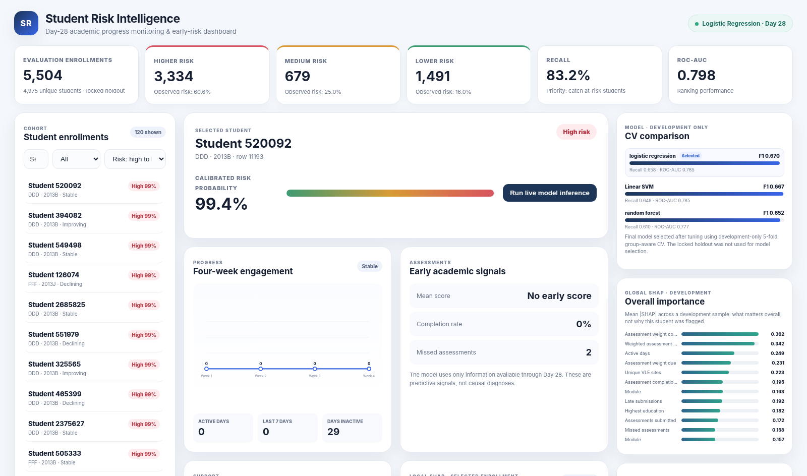

# Student Risk Intelligence — OULAD

Early-warning machine learning system that uses the **first 28 days** of student activity to estimate academic risk and support timely human intervention.



## Project objective
Predict whether an enrollment is **At Risk** by Day 28 using only information available up to that point.

- **At Risk (1):** Fail or Withdrawn
- **Not At Risk (0):** Pass or Distinction
- `final_result` is used only to construct the target; it is never a predictor.
- `id_student` is used only for group-aware splitting; it is never a predictor.

## Course workflow
The main notebook contains the analysis and the classification models used for the course:

`notebooks/Student_Risk_Analysis_and_Models.ipynb`

It covers:
- problem and risk definition
- leakage removal
- development / locked-evaluation split by student
- EDA
- missing-value handling
- categorical encoding
- feature scaling
- Logistic Regression
- Naive Bayes
- KNN
- Linear SVM
- Decision Tree
- Random Forest
- 5-fold student-group-aware cross-validation
- model comparison and selection

The additional explainability, calibration, fairness, recommendation, and dashboard components extend the course requirements without replacing the core workflow.

## Final model
**Logistic Regression** (`C=0.05`, `class_weight="balanced"`) was selected using development-only cross-validation.

Locked evaluation results:

| Metric | Result |
|---|---:|
| Accuracy | 68.71% |
| Precision | 60.59% |
| Recall | 83.20% |
| F1 | 70.11% |
| ROC-AUC | 79.77% |
| PR-AUC | 77.70% |

The evaluation set contains **5,504 enrollment rows from 4,975 unique students** with zero student overlap with development.

## Dashboard
The web dashboard turns model outputs into an advisor-facing workflow:

**student → risk probability → risk level → early progress → local explanation → recommended support action**

It also includes global SHAP importance, model-CV comparison, fairness diagnostics, and live model inference.

### Run locally
```bash
pip install -r requirements.txt
python demo/app.py
```

Open:

`http://127.0.0.1:8765`

On Windows, `py demo\app.py` works as well.

## Project structure
```text
student-risk-oulad/
├── README.md
├── requirements.txt
├── render.yaml
├── notebooks/
│   └── Student_Risk_Analysis_and_Models.ipynb
├── demo/
│   ├── app.py
│   └── static/
├── src/
├── data/
│   └── processed/
├── reports/
│   ├── final/
│   ├── tuning/
│   └── course_models/
└── docs/
    ├── Project_Presentation.pptx
    ├── Project_Report.docx
    ├── MODEL_CARD.md
    └── dashboard_preview.png
```

## Key files
- **Notebook:** `notebooks/Student_Risk_Analysis_and_Models.ipynb`
- **Dashboard:** `demo/app.py`
- **Final model bundle:** `reports/final/final_risk_bundle.joblib`
- **Final metrics:** `reports/final/final_test_metrics.json`
- **Presentation:** `docs/Project_Presentation.pptx`
- **Report:** `docs/Project_Report.docx`

## Methodology note
The packaged evaluation cohort is treated as a **locked evaluation holdout**, not as a pristine external test set, because diagnostics were viewed during earlier project development. Model selection and course-model comparisons use development-only cross-validation. Future-cohort or external validation is recommended before real deployment.

## Responsible use
This is an **early-support prototype**, not an autonomous grading, admissions, discipline, or exclusion system. Risk predictions and explanations require human review and should be used to prioritize supportive intervention.
